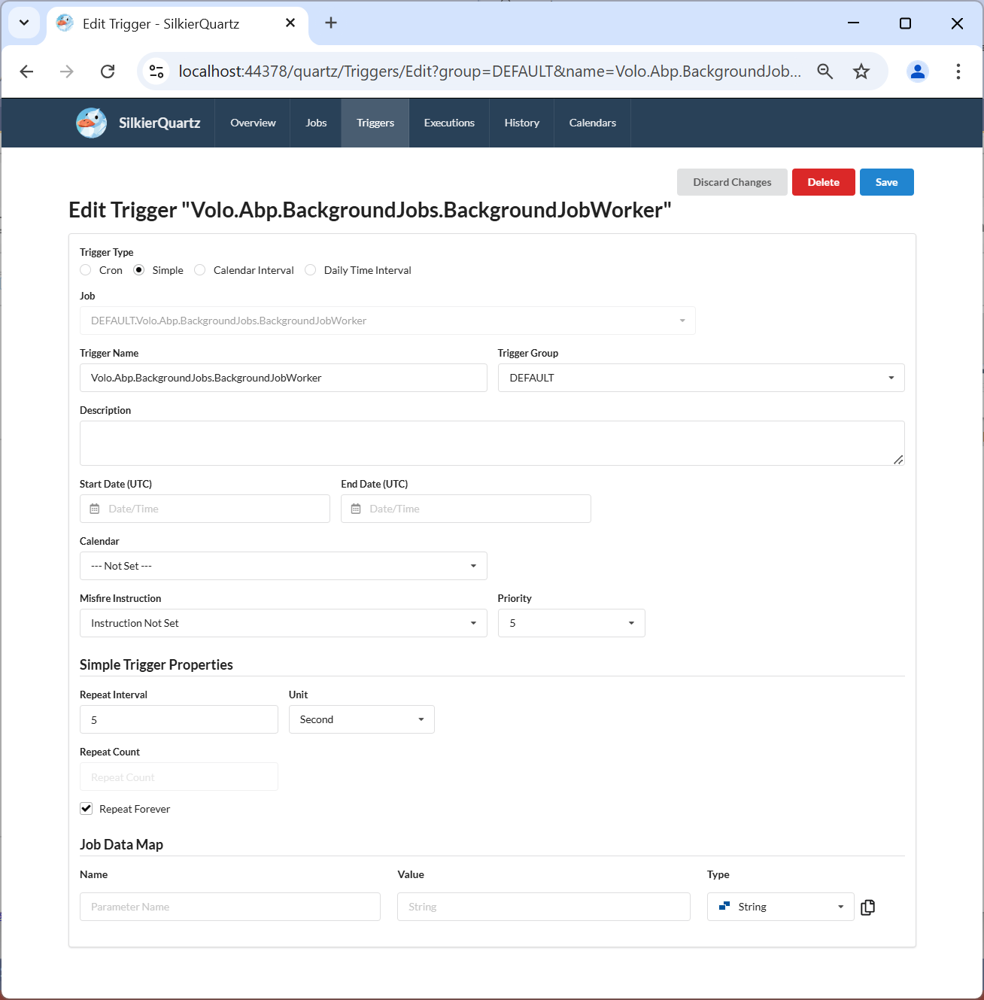

# Abp.SilkierQuartzDemo

## Abp.SilkierQuartz based on [SilkierQuartz](https://github.com/IoTSharp/SilkierQuartz).

SilkierQuartz is a new after merging  [Quartzmin](https://github.com/jlucansky/Quartzmin) and  [QuartzHostedService](https://github.com/mukmyash/QuartzHostedService)!

> [Quartz.NET](https://www.quartz-scheduler.net) is a full-featured, open source job scheduling system that can be used from smallest apps to large scale enterprise systems.

> [Quartzmin](https://github.com/jlucansky/Quartzmin) Quartzmin is powerful, easy to use web management tool for Quartz.NET

>  [QuartzHostedService](https://github.com/mukmyash/QuartzHostedService) QuartzHostedService is easy to host Quartz as service in .Net Core !

So  

SilkierQuartz can be used within your existing application with minimum effort as a Quartz.NET plugin when it automatically creates embedded web server.

### This application created with ABP 9.1.1 and .Net 9.0 Frameworks.

